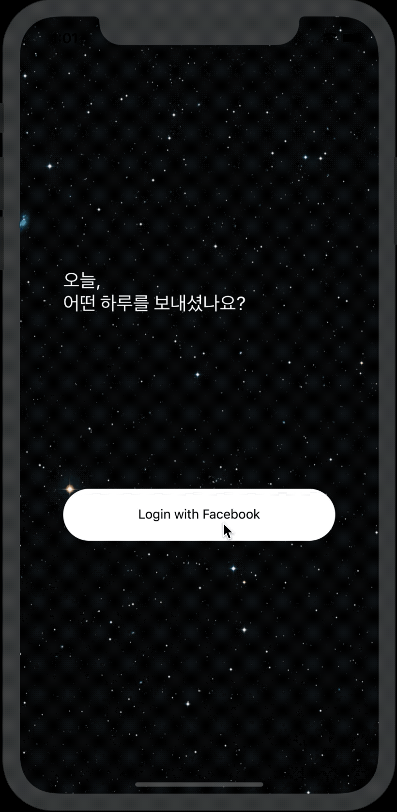
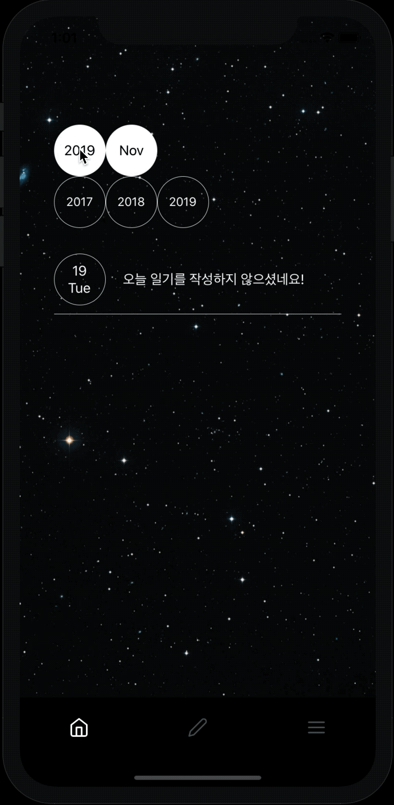
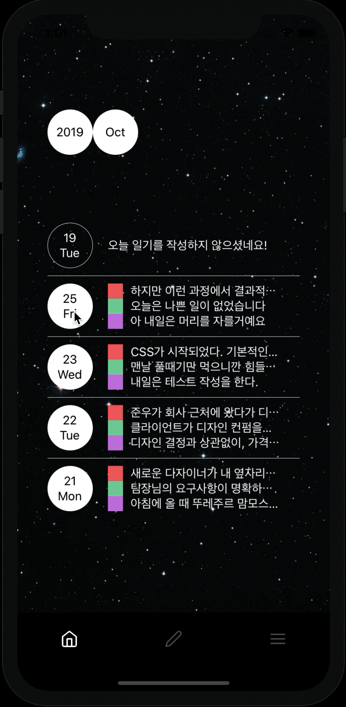
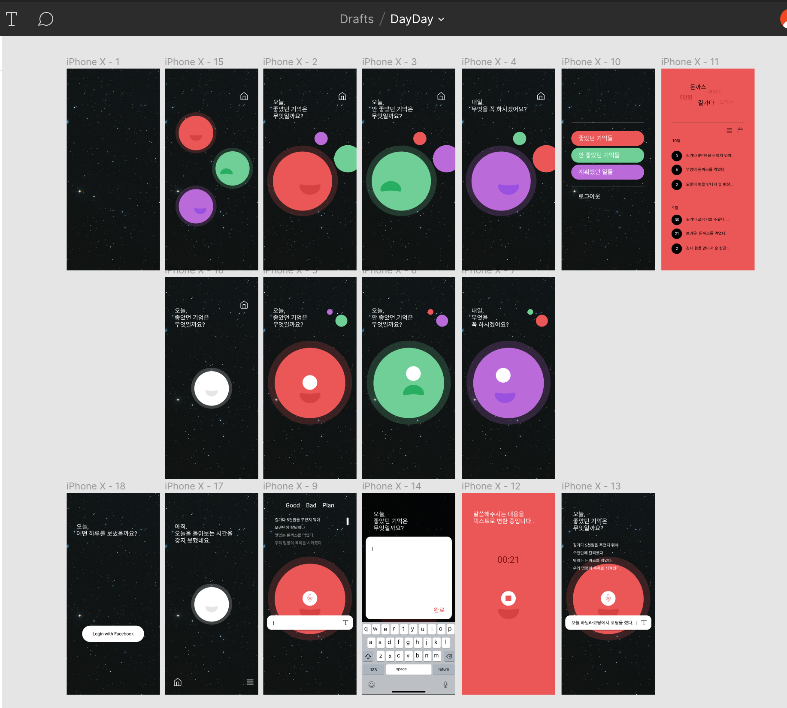

# Introduction

- 좋았던 일(Good), 나빴던 일(Bad), 내일 할 일(Plan) 3가지 주제로 작성하는 일기 iOS앱 애플리케이션

# Features

- Facebook을 이용한 로그인 구현
- 월 단위, 일 단위 일기 조회
- Good, Bad, Plan 3가지 카테고리로 일기 작성
- Speak to Text 기능. 보이스 녹음으로 일기 작성

## User Case

1. Facebook 로그인 <br/>
   

2. 월 단위 일기 조회 <br/>
   

3. 일 단위 일기 조회 <br/>
   

4. 카테고리별 일기 작성 (텍스트모드/음성모드 전환) <br/>
   

# Requirement

- Facebook 로그인을 사용

# Installation

## (1) Client

```
git clone https://github.com/dwook/dayday-client
cd dayday-client
react-native run-ios
```

## (2) Server

```
git clone https://github.com/dwook/dayday-server
cd dayday-server
npm install
npm start
```

# Skills

## (1) Client

- Modern Javascript(ES2015+)
- React를 이용한 컴포넌트 기반의 구조
- React Native
- React Navigation
- React Context API를 이용한 상태관리
- Styled Component를 이용한 스타일링
- 음성인식 라이브러리 react-native-voice 사용
- React Native의 Animated 모듈을 이용한 모션 구현

## (2) Server

- Modern Javascript(ES2015+)
- Node.js
- Express.js
- MongoDB Atlas/Mongoose를 이용한 일기, 유저 정보 저장

# Version Control

- Git과 Github을 이용한 Version Control
- Client와 Server의 독립적인 관리를 위해 Git Repository 분리

# Project Control

- Notion을 이용한 스케줄 관리 및 Task 정리
- Figma를 이용한 유저 인터페이스 디자인 설계



# Deployment

## Server

- Circle CI 배포자동화
- AWS Elastic Beanstalk 이용한 Server 배포

# Challenges

- 기획 당시, Expo 프레임워크에는 작성된 텍스트를 읽어주는 Text-to-speech API는 존재하나, 말하는 내용을 텍스트로 변환해주는 Speech-to-text API가 없었습니다. Expo를 사용할 이유가 없어서 React Native로만 프로젝트를 진행하기로 했습니다. 처음 작업해보는 애플리케이션 제작이었지만, 순수한 React Native 개발방식을 먼저 느껴볼 수 있는 경험이었습니다.
- React Native의 StyleSheet 모듈로는 스타일 관리 측면에서 불편함이 존재하여 Styled Component 라이브러리를 사용했습니다.
- 키보드를 통한 텍스트 입력과 음성을 통한 텍스트 입력의 전환을 자연스럽게 하고자 외부 모션 라이브러리들을 사용하고자 했습니다. 그러나 라이브러리들이 React Native와 버전 호환이 맞지 않거나 제대로 동작하지 않아 결국 React Native에서 기본적으로 제공하는 Animated 모듈을 사용해서 모션을 구현하였습니다. 처음 의도했던 만큼의 자유로운 모션을 구현하지 못해 아쉬움이 많이 남습니다.

# Things to do

- Good, Bad, Plan 카테고리별 빈도수가 높은 단어를 보여주는 워드 클라우드.
- Fluid Transition 라이브러리를 사용하여 네비게이션의 경계가 느껴지지 않게 하는 모션
- 보이스 녹음 시, 녹음 길이를 알려주는 초시계 인터페이스
- 컴포넌트 유닛 테스트
- 서버 API 유닛 테스트
